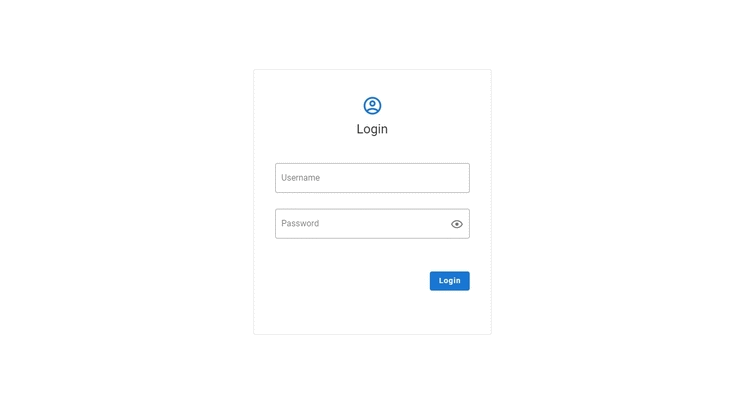

# NodeCMS

A simple material design CMS based on Node.

## Overview

This project based on Node.js, main focus on **server** and **admin**, **front** is a clientside sample just for testing or showing it worked.

- server (backend) - Express + MySQL + JWT

- admin (adminside) - Vue + Vuetify + axios

- front (clietside) - same as above

For more details, please check the README in these folders.

## Screenshots

## About

I built this project as my graduation project, everything works except non-finished part (see **admin**), maybe won't finish in the future.

## License

[MIT](https://choosealicense.com/licenses/mit/)
