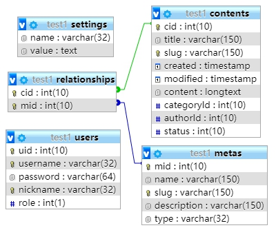

# NodeCMS

NodeCMS server based on Express.

## Description

An Express.js based backend.

Techstack: Express, MySQL, JWT, bcrypt, @hapi/joi

Database example:



## Installation

```
# install dependencies
npm install

# Compiles and hot-reloads for development
npm start

```

## Usage

Edit and rename [.env.example](.env.example) to .env before run.

You can import [example.sql](example.sql) to your database for testing.

## License

[MIT](https://choosealicense.com/licenses/mit/)
